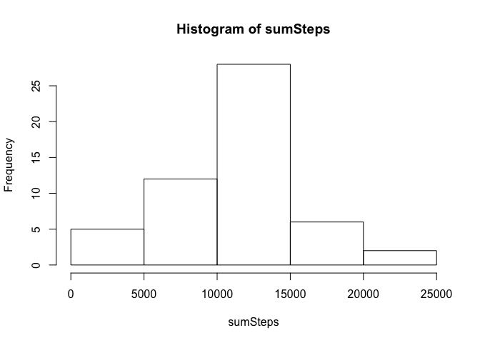
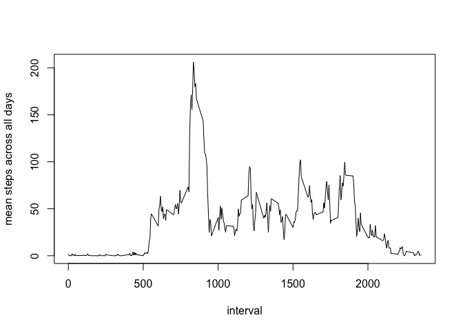
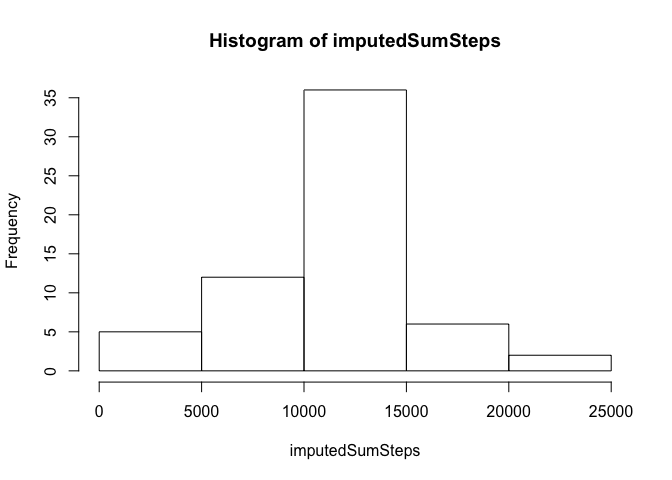
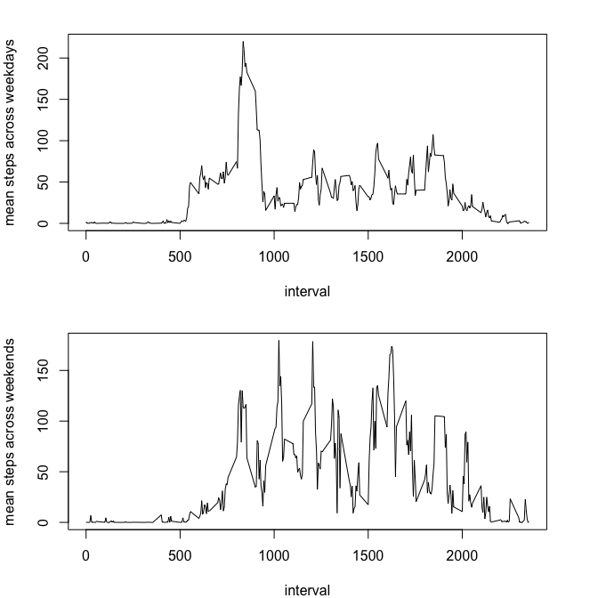

## Loading and preprocessing the data
Load the data using the readr package which supports unzipping of the csv file

```r
library(readr)
activity <- read_csv("activity.zip")
```

```
## Parsed with column specification:
## cols(
##   steps = col_double(),
##   date = col_date(format = ""),
##   interval = col_double()
## )
```

```r
str(activity)
```

```
## Classes 'tbl_df', 'tbl' and 'data.frame':	17568 obs. of  3 variables:
##  $ steps   : num  NA NA NA NA NA NA NA NA NA NA ...
##  $ date    : Date, format: "2012-10-01" "2012-10-01" ...
##  $ interval: num  0 5 10 15 20 25 30 35 40 45 ...
##  - attr(*, "spec")=
##   .. cols(
##   ..   steps = col_double(),
##   ..   date = col_date(format = ""),
##   ..   interval = col_double()
##   .. )
```


## What is mean total number of steps taken per day?
Calculate the sum of the total steps per day. Ignore NA's

```r
sumSteps <- with(activity, tapply(steps, date, sum))
```

Histogram of the total number of steps taken each day

```r
hist(sumSteps)
```

<!-- -->

Calculate and report the mean and median of the total number of steps taken per day. 
Ignore NA's

```r
mean(sumSteps, na.rm=TRUE)
```

```
## [1] 10766.19
```

```r
median(sumSteps, na.rm=TRUE)
```

```
## [1] 10765
```


## What is the average daily activity pattern?

Time series plot (i.e. type="l") of the 5-minute interval (x-axis) and the average number of steps taken, averaged across all days (y-axis)

```r
meanSteps <- with(activity, tapply(steps, interval, mean, na.rm=TRUE))
plot(unique(activity$interval), meanSteps, type="l", xlab = "interval", ylab="mean steps across all days")
```

<!-- -->

5 minute interval which contains the maximum number of steps?  
(on average across all the days in the dataset)

```r
interval <- which.max(meanSteps)
interval
```

```
## 835 
## 104
```
interval: 835  
averaged steps in interval: 206.1698113

## Imputing missing values

Number of rows with missing values in the dataset   

```r
nrow(subset(activity, is.na(activity$steps)))
```

```
## [1] 2304
```

Strategy to impute the missing values: mean of interval. 

```r
library(plyr)
impute <- function(x) replace(x,is.na(x), mean(x,na.rm=TRUE))
imputed <- ddply(activity,~interval,transform,steps=impute(steps))
```

Histogram of the total number of steps taken each day

```r
imputedSumSteps <- with(imputed, tapply(steps, date, sum))
hist(imputedSumSteps)
```

<!-- -->

Calculate and report the mean and median of the total number of steps taken per day. 

```r
mean(imputedSumSteps)
```

```
## [1] 10766.19
```

```r
median(imputedSumSteps)
```

```
## [1] 10766.19
```

#### Do these values (mean, median) differ from the estimates from the first part of the assignment?  
The mean value is unchanged as we replaced the NA's with the mean values and before we ignored NA values in the mean calculation. The median is now the same as the mean value. Coincidence?

  
#### What is the impact of imputing missing data on the estimates of the total daily number of steps?
The total daily number of steps increase because the NA values were replaced with the interval mean number of steps

## Are there differences in activity patterns between weekdays and weekends?

Add a factor variable for weekend and weekdays, subset the activities and calculate mean step values by interval

```r
imputed <- mutate(imputed,wd = ifelse(weekdays(date) %in% c("Saturdy", "Sunday"), "weekend", "weekday"))
imputed$wd <- as.factor(imputed$wd)

weekdayActivities <- subset(imputed,wd=="weekday")
weekendActivities <- subset(imputed,wd=="weekend")

meanWeekdaySteps <- with(weekdayActivities, tapply(steps, interval, mean))
meanWeekendSteps <- with(weekendActivities, tapply(steps, interval, mean))
```

Generate plots for weekdays and weekends:

```r
par(mfrow=c(2,1), mar=c(4,4,2,3))
plot(unique(activity$interval), meanWeekdaySteps, type="l", xlab = "interval", ylab="mean steps across weekdays")
plot(unique(activity$interval), meanWeekendSteps, type="l", xlab = "interval", ylab="mean steps across weekends")
```

<!-- -->
